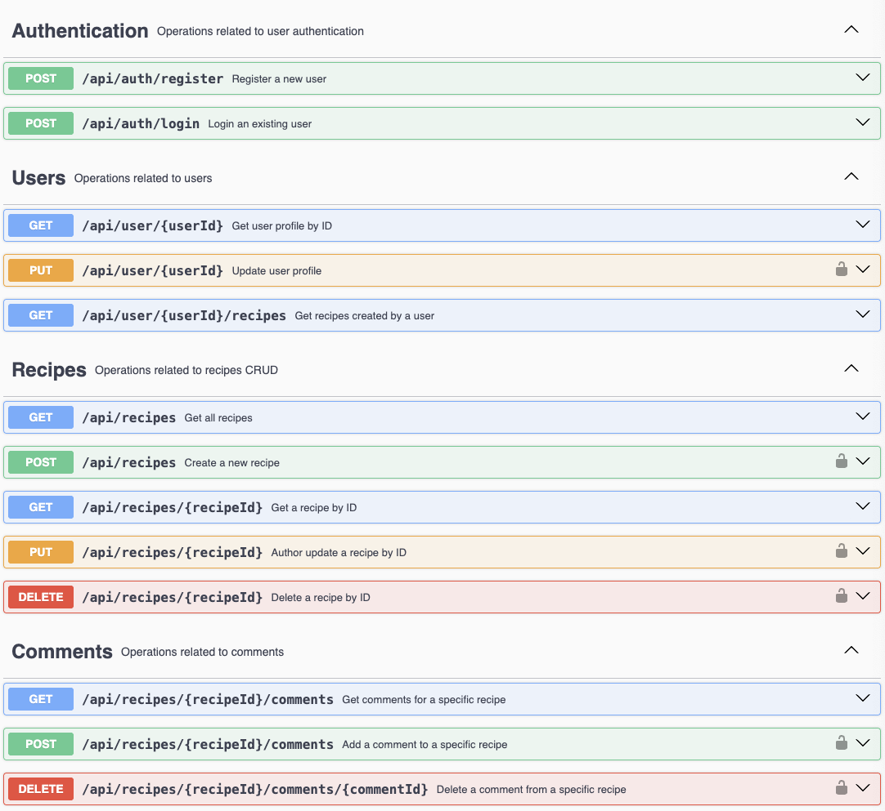

# CookMate Backend

A RESTful API for managing recipes, user authentication, favorites, likes, and comments. Built with Node.js, Express, and MongoDB. This backend powers the CookMate app, enabling users to create, edit, and share recipes, as well as interact with other users.

## Features

- User registration and authentication (JWT)
- Recipe creation, editing, and deletion (only by the author)
- Add and remove recipes from favorites
- Like and unlike recipes
- Comment on recipes (only authenticated users)
- View user profiles and their favorite recipes
- Secure endpoints and data validation

## Technologies

- Node.js
- Express
- MongoDB & Mongoose
- JWT for authentication

## Getting Started

1. **Clone the repository:**

   ```bash
   git clone https://github.com/Meva1997/cookMate_backend.git
   cd cookMate_backend/backend
   ```

2. **Install dependencies:**

   ```bash
   npm install
   ```

3. **Set up environment variables:**

   - Create a `.env` file with your MongoDB URI and JWT secret:
     ```
     MONGODB_URI=your_mongodb_uri
     JWT_SECRET=your_jwt_secret
     ```

4. **Run the server:**
   ```bash
   npm start
   ```
   The server will run on `http://localhost:4000`.

## API Documentation

Interactive API documentation is available via Swagger UI:



- **URL:** [http://localhost:4000/docs](http://localhost:4000/docs)

You can explore all endpoints, view request/response schemas, and test API calls directly from the browser. For protected endpoints, use the "Authorize" button to enter your JWT token.

### Endpoints and middleware covered by unit tests

The test suite includes focused unit tests that exercise handlers and middlewares without touching the database or external services (those are mocked). Current coverage includes the following endpoints and related middleware logic:

- Auth endpoints

  - POST /auth/register
    - createAccount handler
    - Validation flow (registerBody + handleBodyErrors)
    - Duplicate handle/email checks (user existence middleware)
    - Password hashing flow is mocked to avoid bcrypt I/O
  - POST /auth/login
    - login handler
    - Validation flow for email/password
    - loginEmailExists middleware (email existence)
    - JWT generation and comparison are mocked

- User endpoints

  - GET /user/:userId
    - getUserProfile handler
    - userExistsId middleware behavior (user found / not found / server error)
  - PUT /user/:userId
    - updateUserProfile handler
    - Authorization checks (authenticated user vs target user)
    - Handle/email uniqueness checks
    - Save/update flow using a document-like mock (instance.save mocked)
  - GET /user/:userId/recipes
    - getUserRecipes handler
    - Mocks populate() behavior to return user's recipes

- Recipe endpoints (unit-level)

  - Tests exercise recipe handlers for create/read/update/delete operations
  - Authorization and ownership checks (only author can edit/delete)
  - Likes/favorites behavior is covered in unit tests with mocked model methods

- Middleware & utilities
  - Validation error handler (handleBodyErrors)
  - authenticateJWT middleware is exercised in tests (success/unauthorized cases)
  - email/handle existence middlewares (emailExists, userExistsId)
  - Utilities like slug, jwt, and password helpers are mocked to isolate handlers

Notes:

- Tests use fixtures in `src/tests/mocks/*` and mock `../../models/*` to avoid DB access.
- Some ESM modules (e.g. `slug`) are mocked in tests to prevent runtime syntax issues.
- For edge-case behavior, tests include success, validation failure (400), conflict (409), unauthorized (401), and internal error (500) paths.

## Unit testing

Run the test suite with Jest:

- Run all tests:

  ```bash
  npm test
  ```

- Run a single test file:

  ```bash
  npx jest src/tests/unit/UserController.test.ts
  # or
  npm test -- src/tests/unit/UserController.test.ts
  ```

- Watch mode (re-run tests on file changes):

  ```bash
  npm test -- --watch
  ```

- Run with coverage report:

  ```bash
  npm test -- --coverage
  ```

- Troubleshooting and tips

  - If a test times out or you need to diagnose handles:
    ```bash
    npm test -- --detectOpenHandles
    ```
  - ts-jest warning (TS151002): either enable isolatedModules in tsconfig.json:
    ```json
    {
      "compilerOptions": {
        "isolatedModules": true
      }
    }
    ```
    or silence the diagnostic in jest.config.js:
    ```javascript
    // jest.config.js
    module.exports = {
      globals: {
        "ts-jest": {
          diagnostics: {
            ignoreCodes: [151002],
          },
        },
      },
    };
    ```
  - Some third‑party ESM modules (e.g. `slug`) may need mocking in tests. Options:
    - Add a per-test mock at the top of the test file:
      ```typescript
      jest.mock("slug", () => {
        const fn = (s: unknown) => String(s).toLowerCase().replace(/\s+/g, "-");
        (fn as any).default = fn;
        return fn;
      });
      ```
    - Or create a module mock and map it in jest.config.js:
      ```javascript
      moduleNameMapper: { "^slug$": "<rootDir>/src/tests/__mocks__/slug.js" }
      ```
  - Use `setupFilesAfterEnv` or a shared test setup file to centralize common mocks and fixtures.

- Run tests on macOS terminal (example):
  ```bash
  # from project root
  cd /Users/$(whoami)/Desktop/cookmate/backend
  npm test
  ```

## API Endpoints

### Auth

- `POST /auth/register` – Register a new user
- `POST /auth/login` – Login and receive JWT

### User

- `GET /user/:userId` – Get user profile
- `PUT /user/:userId` – Update user profile (authenticated)
- `GET /user/:userId/recipes` – Get user's recipes
- `GET /user/:userId/favorites` – Get user's favorite recipes

### Recipe

- `GET /recipes` – List all recipes
- `POST /recipes` – Create a recipe (authenticated)
- `GET /recipes/:recipeId` – Get recipe by ID
- `PUT /recipes/:recipeId` – Edit a recipe (only author)
- `DELETE /recipes/:recipeId` – Delete a recipe (only author)
- `POST /recipes/:recipeId/like` – Like a recipe (authenticated)
- `DELETE /recipes/:recipeId/like` – Unlike a recipe (authenticated)
- `POST /recipes/:recipeId/favorite` – Add to favorites (authenticated)
- `DELETE /recipes/:recipeId/favorite` – Remove from favorites (authenticated)

### Comment

- `GET /recipes/:recipeId/comments` – Get comments for a recipe
- `POST /recipes/:recipeId/comments` – Add a comment (authenticated)
- `DELETE /recipes/:recipeId/comments/:commentId` – Delete a comment (only author, authenticated)

## License

MIT
